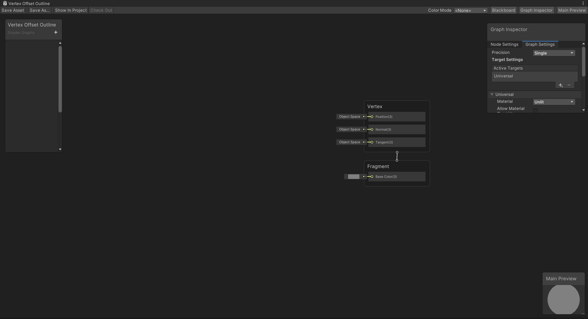
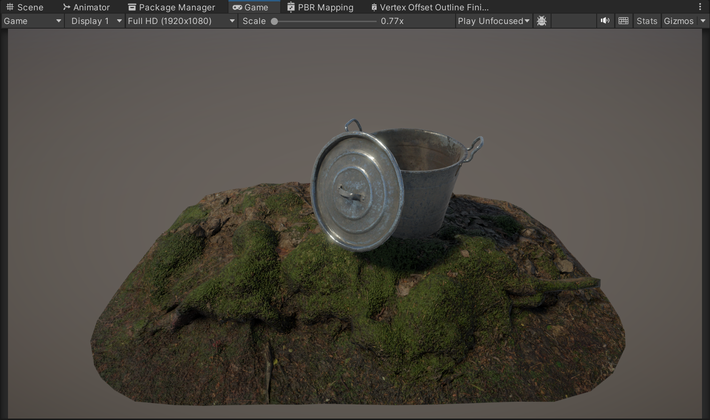

# 软设第六讲 - Unity

**by gx, whr**

## 〇、目录

[TOC]


## 一、Unity 介绍

### 1. 什么是游戏引擎？
-   游戏引擎（Game Engine）是一个用于开发电子游戏或其他交互式实时图像应用程序的综合软件框架，为开发者提供实现游戏功能所需的基本工具系统，包括图形渲染、物理模拟、声音、动画、网络通信等。功能上，它通常包含可视化编辑器、脚本支持以及与硬件交互的接口，使得游戏开发更加高效和灵活。
-   游戏引擎的主要作用是简化游戏开发流程，不需要开发者从零开始编写每个基础功能，而是允许开发者专注于游戏内容和创意，直接使用引擎的部分功能快速编写出游戏。
-   目前常用的游戏引擎有：Unity、Unreal Engine、Cocos2dx、Godot 等

### 2. 什么是 Unity？
- Unity 是一款跨平台的游戏开发引擎，可以用于开发 2D 和 3D 游戏。它提供了一个可视化的开发环境，使开发者可以轻松地创建游戏场景、添加游戏对象、设置动画和物理效果等。
- Unity 使用 C# 作为主要的脚本编程语言，开发者可以通过编写脚本来控制游戏对象的行为逻辑；Unity 还提供了许多内置的功能和工具，如碰撞检测、音频管理、粒子效果等，使开发者能够更加方便地实现各种功能。
- Unity 支持跨平台发布，开发者可以通过一次开发，将同一个游戏高效地发布到 Windows、macOS、iOS、Android、WebGL 等多个平台，触达更多的玩家。
### 3. 为什么选择 Unity？
- 成熟，应用广泛，（与 UE 相比）更轻量级
- 简单易学，上手快
- 学习路径完善，学习资源丰富，教程、文档、社区论坛等资源全面充足
## 二、环境配置与安装
### 1. 版本

截至讲义编写时的最新 LTS（长期支持）版本：

- Unity Hub：3.11.0 / 3.3.3-c2 (*)
- Unity Editor：2022.3.56f1 / 2022.3.52f1c1 (*) (**)
- 代码编辑器：Visual Studio / Visual Studio Code / JetBrains Rider

> (&#42;) 注1：如果不使用*额外的网络工具*，大陆地区下载到的 Unity Hub / Unity Editor 通常为版本号带 c 后缀的国内特供版，而不带 c 后缀的则为国际版。通常情况下两者在使用上没有明显差别，但需要注意，较新的国内版 Unity Hub 在较为明显的位置放置了“团结引擎”的下载按钮（如下图），无视即可。
>
> 
>
> (&#42;&#42;) 注2：考虑新版本可能存在的稳定性问题，本次教程暂时不以 Unity 6 为基准版本。

### 2. 安装步骤
1. Unity Hub 安装：[官网](https://unity.com/cn/download) 下载并安装 Unity Hub，用于管理 Unity 版本和项目；

2. Unity Editor 安装：在 Unity Hub 界面的左侧栏选择“安装”，点击右上角“安装编辑器”按钮，在“正式发行”（LTS）一栏找到需要下载的 Unity Editor（此处选择版本 2022.3.52f1c1）进行安装：

   

   Visual Studio 、开发平台和文档等项可视需求勾选。新版本 Unity 安装时可以直接选择简体中文配置，不需要额外汉化包（但其翻译质量较微妙）。

   

   需要注意的是，Unity 各大版本之间兼容性较差。一般而言同一大版本的 LTS 版本之间差距不大，但切换大版本时通常会出现一些兼容性问题，因此一旦选定了一个大版本进行团队开发，就要统一 Unity 版本并一直使用到项目结束。

3. 获取 Unity 授权的免费个人版激活许可证

4. 代码编辑器可使用 Visual Studio（需要在安装时勾选“使用 Unity 的游戏开发”）或者 Visual Studio Code（具体在 Unity Editor 内配置，后续说明）

## 三、创建第一个项目
### 0. Unity 基本知识

<big>**Scene（场景）**</big>

**Scene（场景）** 是一个包含游戏世界的容器，包含了若干 **GameObject（游戏对象）**。一个游戏可能由多个场景组成，通过脚本在它们之间进行切换。例如，一个游戏可能包含 MenuScene（菜单场景）和 GameScene（游戏场景）。对于关卡类的游戏，可以为每个关卡独立创建一个游戏场景。

<big>**GameObject（游戏对象）**</big>

**GameObject（游戏对象）** 是 Unity 中最基本的实体单位。它可以代表场景中的任何物件，如角色、道具、环境物体等。GameObject 之间可以存在父子关系，这里的父子关系是一种层级上的组合关系或从属关系，并非父类与子类的继承关系。

<big>**Component（组件）**</big>

每个 GameObject 可以拥有若干个 **Component（组件）**，每个组件都代表着 GameObject 所具有的一种功能、行为或性质，当 GameObject 被实例化并且处于活动（Active）状态，且 Component 也处于活动状态时，它便可以控制 GameObject 的行为。通过在某些游戏对象上挂载对应的组件，可以实现特定的功能。

<big>**Script / MonoBehaviour（脚本）**</big>

**MonoBehaviour 脚本** 实际上就是一种**自定义的 Component**，可以通过编写 C# 脚本来自定义对 GameObject 行为的控制方式，从而实现游戏所需的各种复杂逻辑。

<big>**Prefab（预设/预制件/预制体）**</big>

游戏中经常会有一些在不同时间、不同位置或不同场景重复出现的物件（如子弹、NPC、环境装饰等），在这种情况下我们可以使用 **Prefab** 以减少不必要的重复工作。Prefab 相当于一个 GameObject 的**模板**，在游戏开发和运行过程中，可以由它实例化（Instantiate）出对应的 GameObject。开发过程中，当 Prefab 被修改时，它的所有 GameObject 实例也会被修改。

<big>**Material（材质）和 Shader（着色器）**</big>

**Shader（着色器）** 是定义如何渲染物体的程序，主要包括顶点着色器和片段着色器。它负责计算物体的颜色、光照等效果；
**Material（材质）** 是控制游戏对象外观的资源，包含颜色、纹理、透明度等基本属性，也可以包括高光度、粗糙度、法线等物理 / 几何信息。每个材质都与一个 Shader 关联，决定物体如何与光源互动和呈现视觉效果，可以理解为是 Shader 的一个容器。由于通常在球模型上预览，也被称为 “**材质球**”。

<big>**Mesh（网格）/ Model（模型）**</big>

**Mesh** 是 3D 模型的几何数据，包含顶点、边、面、法线信息和 UV 坐标等，定义物体的形状。在 Unity 中，Mesh 通过 `MeshFilter` 和 `MeshRenderer` 组件显示和渲染。习惯上 **Model** 指 Mesh 加上材质、动画等其他数据构成的可渲染对象，不过通常区分这两者并不重要。

<big>**Sprite（精灵）**</big>

**Sprite（精灵）** 是 2D 游戏中的图像对象，使用 `SpriteRenderer` 组件进行渲染。UI 元素（如按钮、图标等）也使用 Sprite 显示图像。

<big>**Assets（资源/资产）**</big>

项目中的所有 Prefab、脚本、材质、2D 精灵图、3D 模型/纹理、音乐、场景数据、配置文件等资源都被称作 **Asset**，置于项目的 Assets 文件夹中。对于规模较大的工程，应该建立规范的目录结构。

### 1. 界面介绍
#### Unity Hub
在Unity Hub界面，点击“新项目”，进入创建项目界面。本次培训中，我们主要以 3D 项目为例，介绍 Unity 的基本操作；同时，为了节约环境配置时间，我们直接以 URP（通用渲染管线）模板创建项目：（关于渲染管线，在昨天的图形学一讲中已经初步提及，更进一步的解释详见后文介绍）


左侧可以选择创建模板类型，选择“核心模板”，“Universal 3D”，在右侧点击“下载模板”。


待下载结束后，可以修改合适的项目名称和位置，然后点击“创建项目”。（不要勾选“启用游戏云服务”和“使用团结云开发”）
（注1：“游戏云服务”是 Unity 中国提供的一系列 *付费* 服务；“团结云开发”是指 Unity 自行开发的版本管理系统 PlasticSCM，由于安装过程繁琐且只适用于 Unity，感兴趣的同学们可自行了解。培训第一天我们讲解了 git，如果此前没有过使用 git 的经验，推荐借助软设开发的机会熟悉一下 git 的操作）
（注2：项目名和项目路径中最好不要有中文，可能会导致导出项目时因编码问题报错）


等待一小段时间过后，我们进入了 Unity Editor 界面：


此时，界面右侧显示的是 URP 模板的欢迎页面，点击中部的 "Remove Readme Assets" 按钮以移除相关内容。

#### Unity Editor
##### 常用窗口
- Hierarchy（层级）：用于查看当前所选场景中的各个 GameObject 以及它们之间的层级关系（父子关系）。通过将对应资源拖拽进入该区域，可以为场景添加新的 GameObject；
- Project（项目）：用于查看当前项目所用到的各种资源（脚本代码、预制体、美术资源、材质资源、音乐资源等）。项目中的各种资源主要存放在 Assets 和 Library 两个文件夹中，前者是项目构建中主要用于操作的文件夹，后者主要存放项目引用的外部包资源和项目运行过程中生成的各种缓存文件；
- Console（控制台）：用于查看控制台输出，可用于查看报错信息和项目 Debug 输出信息；
- Inspector（检查器）：检查当前所选 GameObject 或 Asset 的属性，为游戏对象添加、更改或删除组件等；
- Scene（场景）、Game（游戏）：**核心操作面板**。场景面板用于调整游戏对象位置、大小等在游戏场景中的形态。游戏面板等于是对游戏功能的测试，能够准确体验游戏的运行状态。当我们在场景中完成全部的部署之后，点击运行按钮，就可以开始游戏（开始测试）。中断按钮可以暂停当前游戏并切换回场景面板以查看对象的实时属性。
### 2. 游戏对象
#### ① 初始对象
- 项目初始化后，初始场景 Sample Scene 会自带游戏对象 Main Camera 和 Directional Light。Main Camera 用于将其范围内的游戏场景在游戏界面中显示出来，Directional Light 则作为场景的主光源（“太阳”）将场景照亮。
- Main Camera 挂载的 Camera 组件可以设置摄像机的诸多属性（如画面大小），Transform 组件可以使摄像机在游戏进程中随时改变位置，获得灵活的运镜效果（这在3D游戏中尤为重要）
#### ② 静态对象的创建
- Unity 提供了一系列简单的几何对象：

  

  利用“场景”左上角的变换工具对模型进行变换，在检查器面板上观察图形的 Transform 组件变化：

  

- 如何添加素材作为游戏对象？

1. 将素材导入到项目文件夹 Assets 下（注意尽可能按照资源类别细分素材并建立文件夹，如 Scenes、Scripts、Materials、Sprites、Models 等）
2. 在检查器中设置需要导入的素材的相关属性。由于创建项目时选择了 3D 项目模板，需要手动将图片类型设置为 Sprite（精灵）。对于一般的 2D Sprite 图片素材，推荐更改 Filter Mode（过滤模式）为 “Point（点）”，Compression（压缩）修改为 “None（无）”，更改后点击 Apply（应用）。


3. 拖拽素材进入场景，可以看到“层级”视图中新增了游戏对象
- 对于 2D Sprite 素材，需要手动切分帧图片和导入动画：

  0. 由于创建项目时选择了 3D 项目模板，需要手动安装 2D Sprite 包。在 Package Manager（包管理器）窗口中如下图操作：

     

  1. 选择需要切分的帧图片，在检查器中选择 Sprite 模式为“多个”，点击“应用”后单击“Sprite Editor”进入 Sprite 编辑器，在左上角的切片中按照 cell 大小完成切分。

  

  2. 按照顺序选择合成动画的帧，拖拽至对应游戏对象上，Unity即可自动生成动画文件。
  3. 选择对应游戏对象后，在“动画”选项卡（注意不是“动画器”）即可播放对应动画。

- 对于 3D 模型素材（.fbx 等），通常动画已经包含在模型文件中，无需手动配置；

## 四、交互逻辑：组件与脚本
组件就是积木，需要用到的时候就添加。一个个组件共同构建起了**功能完整**的游戏对象。

### 1. 一般组件
以下列出一些常见的 Components 及其对应功能：

|  分类   | 名称                | 功能                                                         |
| :-----: | ------------------- | ------------------------------------------------------------ |
|  通用   | `Transform`（变换） | GameObject 的固有属性：位置、朝向、缩放、层级关系            |
| 3D 外观 | `MeshFilter`        | 为 GameObject 指定一个 3D 模型                               |
|         | `MeshRenderer`      | 用指定的材质（Material）渲染 MeshFilter 中的 3D 模型         |
| 2D 外观 | `SpriteRenderer`    | 用指定的材质渲染 2D 精灵图                                   |
|  渲染   | `Camera`            | 使游戏对象具备摄像机功能                                     |
|         | `Light`             | 使游戏对象具备灯光功能                                       |
|         | `Volume`            | URP / HDRP 自带，指定后处理功能的生效范围<br />若使用内置渲染管线，则需自行导入 Post Processing 包 |
|  物理   | `xxxCollider`       | 各种形状的碰撞器                                             |
|         | `Rigidbody`         | 刚体物理模拟                                                 |
|  动画   | `Animation`         | 在游戏对象上播放某个固定的动画片段（Animation Clip）         |
|         | `Animator`          | 动画状态机                                                   |
|  音频   | `AudioSource`       | 使游戏对象成为一个音频源                                     |
|         | `AudioListener`     | 使对象成为音频监听器（类似麦克风），常挂载于主相机           |
|   UI    | `Canvas`            | UI 画布，所有 UI 元素的根节点                                |
|         | `EventSystem`       | UI 中的鼠标事件监听系统                                      |
|         | （UI 元素）         | `Image`, `Button` , `Input` , `Dropdown` , `Layout` …        |
|  粒子   | `ParticleSystem`    | 使游戏对象成为一个粒子（Particle）发射器                     |
|   ……    | ……                  | ……                                                           |
#### ① 动画系统

- 关于动画，更全面、系统、深层次的应用：动画状态机（Animator）
  -   状态，即动画的效果，比如人物静止的时候会有上下轻微浮动的动画，人物走的时候有个行走的动画，人物攻击的时候有个攻击的动画，跳跃的时候有个跳跃的动画，这些不同的动画状态，都是通过**状态机**连接起来的。
  -   既然有不同的状态，那么就应该有状态转换的条件，比如：
      -   人物什么时候从站立状态转而变成走路的状态 —— 按下 WSAD 键盘
      -   人物放完技能之后应该自动回到站立（挂机）状态，肯定不能一直放技能（有 CD 存在）
      -   这些控制条件由挂载在人物上的脚本，结合 Unity 的动画状态机控制

#### ② 物理系统

值得注意的是，Unity内置了强大的物理系统，可以给对象挂载组件使其符合一定物理规律。

- 给游戏对象挂载 Rigidbody 组件，观察游戏对象行为

  

- 使游戏对象之间发生碰撞：两个对象均挂载了碰撞体（Collider / Collider 2D）组件，运动一方的 Rigidbody 组件碰撞检测设置为 “Continuous（持续）”

  

- 更改游戏对象物理材质（增加反弹、摩擦等）：新建物理材质，设置相关摩擦和弹力系数，替换掉Rigidbody 组件原物理材质。

#### ③ 更多……

作为一个游戏引擎，Unity 中还有很多实用的组件模块，由于本次教程时间有限，不可能一一进行讲解，如果在实际游戏开发中需要用到，参阅 [Unity 官方手册](https://docs.unity3d.com/cn/current/Manual/index.html) 和其他博客、论坛等即可。

### 2. 脚本

#### ① Hello, world!

1. 配置脚本编辑环境：在 Unity 中选择 Edit（编辑） → Preferences（首选项） → External Tools（外部工具） → External Script Editor（外部脚本编辑器），选择自己喜欢的代码编辑器即可；
2. 创建一个简单的脚本：Project 窗口右键 → Create（创建）→  C# Script（C#脚本）

      ```csharp
      using System.Collections;
      using System.Collections.Generic;
      using UnityEngine;
      public class PlayerControl : MonoBehaviour
      {
      	// Start is called before the first frame update
      	void Start()
      	{
      
      	}
      	// Update is called once per frame
      	void Update()
      	{
      
      	}
      }
      ```
  - `MonoBehaviour`：脚本创建时默认会挂载到游戏对象上，因此 class 自动继承 MonoBehaviour。如果该脚本不需要直接挂载到游戏对象上发挥效果，则不需要继承自 MonoBehaviour；
  - `void Start()`：场景加载时执行一次的函数，用于初始化；
  - `void Update()`：游戏运行时每一帧都会执行一次，用于实时同步游戏数据，主要代码通常都需要每一帧都执行。

3. 在 `Start` 函数中写入以下代码，并将脚本挂载到 GameObject 上：

      ```csharp
      Debug.Log("Hello, world!");
      ```
    运行游戏，控制台输出了一次 Hello world 信息：


#### ② 获取当前物体信息

例如，我们想在 `Update` 函数中写一段代码，控制脚本所在的 GameObject，使其每帧向某个方向前进一小段距离，该如何获取 “所在的 GameObject” 的相关信息呢？

在 `Update` 函数中写入以下代码：

```csharp
this.gameObject.GetComponent<Transform>().Translate(Vector3.forward * 0.01f);
```

为了便于初学者理解，这里故意采取了非常繁琐的表达方式，实际上可以简化：
- `this` 指当前脚本对象，显然可以省略；
- `gameObject.GetComponent<XXX>()` 是 Unity 中获取 “gameObject 上挂载的 XXX 类型组件” 的通用方法，而对于 `Transform` 这个所有 GameObject 都具备的组件，Unity 提供了相应的缩写 `gameObject.transform`；
- 为了方便，以上的操作实际上都能直接对脚本对象 `this` 进行，因此 `gameObject` 也可省略；
- `transform.Translate` 函数，含义为将 transform 对应的游戏对象沿指定三维矢量进行平移；

最后可得到最简形式：

```csharp
transform.Translate(Vector3.forward * 0.01f);
```

#### ③ 获取场景信息或其他资源

现在把上一小节的需求改为：使脚本所在的物体以指定的速度，朝着另一个物体的方向前进。于是我们的脚本需要从外界获取两个信息：*速度* 和 *（另一个）目标物体* ，如何操作呢？在脚本中写入以下代码：

```csharp
public class PlayerControl : MonoBehaviour
{
	public float speed;
    // 方便起见这里直接用 Transform 指代 GameObject
    public Transform target;
    
	void Start()
	{
		// 后略
```

回到 Unity Editor，我们便能在 Inspector（检查器）窗口中看到：


实际上，继承了 `MonoBehaviour` 的类，其 **非静态公开成员变量** 便会被 Unity 检测，并显示在 Inspector 中，供开发者在 Unity Editor 中进行配置。（此处表述非常不严谨，实际上涉及到[序列化](https://docs.unity3d.com/cn/2022.3/Manual/script-Serialization.html)过程，具体细节请日后点开链接自行探索）

输入速度数值，将目标物体通过拖动的方式拖到 Target 中，便完成了 Editor 侧的配置，接下来在 `Update` 中写入以下代码：

```csharp
transform.Translate(Vector3.Normalize(target.position - transform.position) * speed * Time.deltaTime);
```

整个表达式只要有高中的数理基础就不难理解，主要注意 `speed * Time.deltaTime`，此处的 `Time.deltaTime`（$\Delta t$）是指 <u>当前帧与上一帧之间</u>  的时间间隔，由于帧率的不稳定，这一间隔也是不稳定的，因此需要通过这样一个接口来获取。这里的 `Time` 类可以被称作一种 “**工具类**“，Unity 提供了很多这样的类，以获取游戏运行中的各种信息或资源。

除此之外，如果想要更方便地通过脚本控制物体的运动动画，可以使用快速、高效、完全类型安全的面向对象动画引擎 [DOTween](https://dotween.demigiant.com/)。例如，如果要使用 DOTween 控制目标在 2.5 秒内移动到世界坐标 $(1,2,3)$ 位置，只需写入如下代码：

```csharp
using DG.Tweening;
// ...
	void Start()
    {
        target.DOMove(new Vector3(1, 2, 3), 2.5f);
    }
```

#### ④ 碰撞事件和触发事件
游戏对象的碰撞体与其他碰撞体发生碰撞时会调用碰撞事件，包括：

- `OnCollisionEnter(2D)`（碰撞开始时执行）
-  `OnCollisionExit(2D)`（碰撞结束时执行）
-  `OnCollisionStay(2D)`（碰撞过程中每个 **固定时间步长** 执行一次）

   ```csharp
   private void OnCollisionEnter(Collision collision)
   { // Collision 类，存储碰撞对象、碰撞位置等信息
   	Debug.Log(name + " collided with " + collision.collider.name);
   }
   ```
在碰撞器组件上勾选了“Is Trigger（是触发器）”后，物体便不会与其他碰撞体发生碰撞，取而代之的是在相互穿过时调用触发事件，包括：

- `OnTriggerEnter(2D)`（接触开始时执行）
- `OnTriggerExit(2D)`（接触结束时执行）
- `OnTriggerStay(2D)`（接触过程中每个 **固定时间步长** 执行一次）

   ```csharp
   private void OnTriggerStay2D(Collider2D collider)
   { // Collider 类，仅包含碰撞体本身的信息
   	Debug.Log(name + " contacting with " + collider.name);
   }
   ```

#### ⑤ MonoBehaviour 生命周期

除了前面提到的 `Start()` , `Update()` , `OnCollisionEnter()` 等函数外，`MonoBehaviour` 中还有很多类似的 **回调函数（Callbacks）**或称 **事件函数（Event Functions）**。游戏运行时，在一个脚本对象从被创建到销毁的过程中，这些预定的事件函数会在一定的条件下、以一定的顺序被 Unity 调用，这就是 `MonoBehaviour` 脚本的**生命周期**。下图列出了一些主要的、常用的事件函数，以及它们在事件周期中被调用的时机和顺序，更详细的信息参见 Unity 官方文档中的[流程图](https://docs.unity3d.com/cn/2022.3/Manual/ExecutionOrder.html)和[表格](https://docs.unity3d.com/cn/current/ScriptReference/MonoBehaviour.html)：


注意到，物理相关的过程处于一个独立的循环中，每个 **固定时间步长** 执行一次，而并非每帧执行一次。这是因为游戏中的帧率是不稳定的，如果物理引擎刷新率与帧率同步，当画面卡顿时，很可能导致物理相关的效果发生穿模等严重错误。（这里的表述可能会让读者误以为逻辑循环和物理循环运行在不同线程上，实际上并非如此，Unity 的逻辑系统是<u>单线程的</u>，欲知详情请见[此文档](https://docs.unity3d.com/2022.3/Documentation/Manual/TimeFrameManagement.html)）

了解事件循环的具体顺序，可以帮助我们实现一些功能。例如，注意到 `LateUpdate()` 在动画之后、渲染之前执行，因此如果我们在 `LateUpdate` 中修改物体的位置，就可以覆盖掉动画组件的影响。

## 五、视觉效果：材质与渲染

> 这一部分与前一讲：实时渲染的内容<span style="color:#333333">**强相关**</span>，因此大部分行文可能会默认大家听过并理解其内容。

### 0. 光栅渲染管线

#### ⓪ 概念


（以上两张图分别出自 2024 暑培 / 寒培《实时渲染基础魔法》）

* 本文不再强调“可编程”，因为事实上所谓的“固定渲染管线”早在 2000 年代就基本消失了。
  * 2008 年 OpenGL 3.0 将固定渲染管线标记为过时（deprecated），2009 年 OpenGL 3.2 完全移除固定渲染管线。


* Unity 的 Scriptable Rendering Pipeline（SRP）中的 "Scriptable" 实际上也并不是指顶点着色器和片元着色器的"可编程"，因为此前的内置（Built-In）渲染管线显然也可以对着色器进行编程，它并不是所谓的“固定渲染管线”。此处的”可编程“指的是在着色器之外，对整个渲染流程进行控制，当然这些就并不在本次教程的范围内了。

#### ① 顶点着色器

- 将 **模型空间（Model / Object / Local Space）** 的顶点坐标通过一系列矩阵变换，转换到 **屏幕空间（Screen Space）**。

此处的一系列矩阵变换，被称为 **MVP**（Model-View-Projection）变换。当然，这些变换矩阵都会由管线的其他部分提供，因此我们无需关注具体的数学细节，此处仅列出变换的大致流程，更清晰的演示及数学细节可见[这篇文章](https://jsantell.com/model-view-projection/)及其 Reference 部分：

|                   模型空间（Object Space）                   |                   世界空间（World Space）                    |                    相机空间（View Space）                    |
| :----------------------------------------------------------: | :----------------------------------------------------------: | :----------------------------------------------------------: |
|  |  |  |

以上三个空间坐标间的转换较简单，仅涉及刚体变换（旋转、平移）

| 相机空间（Camera / View Space） →   裁剪空间（Clip Space） →   归一化设备坐标（NDC） |
| :----------------------------------------------------------: |
|          |

以上转换涉及一些较复杂的透视变换（对于正交投影，则只是简单的拉伸变换），最后还会由归一化的设备坐标变换到实际的屏幕空间坐标。

> 注 1：除 NDC 和屏幕空间坐标外，这里所有的变换矩阵和向量实际上都是四维的。为什么？[Wikipedia:齐次坐标](https://zh.wikipedia.org/wiki/齐次坐标)
> 注 2：从裁剪空间到 NDC、屏幕空间的变换由 GPU 和驱动程序等自动完成，因此实际 Shader 中只需变换到裁切空间即可。

理论上来说，所有与模型的几何信息相关，并且 **不改变顶点数量** 的功能，都可以由顶点着色器实现，例如，可以根据时间等输入来动态地改变顶点位置，以实现波动、变形等效果。除此之外，在实际的工程应用中，顶点着色器也可以用于将更多的几何数据传递给片元着色器，以备处理。下一节中，我们将用 ShaderGraph 可视化编程的形式编写顶点着色器，实现模型描边功能。

#### ② 中间步骤

这一步包括三角形建形、光栅化、对几何信息（uv、法线等）插值等步骤，由引擎或驱动程序等完成。

但在此之前，还可以插入两个步骤：*曲面细分着色器* 和 *几何着色器*。这两个着色器的引入，主要是为了解决顶点着色器<u>无法改变顶点数量</u>的限制，从而对视觉效果实现更灵活的调控，具体细节自行了解。

#### ③ 片元着色器

- 给 **片元（Fragment）**（即未上色的**像素**）上色，这一“上色”操作通常需要利用顶点着色器传入的几何信息（uv）对一些贴图进行采样。

利用 BRDF 对光照信息的计算通常就发生在此步骤：

$$
L(\boldsymbol{x},\boldsymbol{\omega}_o)
=\mathcal{K}_\text{S} L + L_\text{r}^\text{e}(\boldsymbol{x})
=L_\text{r}^\text{e}(\boldsymbol{x},\boldsymbol{\omega}_o)
+\int_\Omega f_\text{r}(\boldsymbol{x}, -\boldsymbol{\omega}_i \rightarrow \boldsymbol{\omega}_o)
\cdot L(\boldsymbol{x},\boldsymbol{\omega}_i)
\cdot \cos\theta_i \, \mathrm{d} \boldsymbol{\omega}_i
$$

理论上来说，所有与颜色（RGB<u>A</u>）有关的功能，都可以由片元着色器实现。<s>后文将用 HLSL 编写片元着色器，实现非真实感渲染中的 Toon Shading（卡通着色）功能。</s>（鸽了x）

### 1. ShaderGraph

**Shader Graph（着色器图）** 是 Unity 中的一种基于节点的可视化着色器编辑器，主要支持 URP 和 HDRP。它允许开发者通过连接不同节点模块，在不编写传统着色器代码的情况下创建和编辑着色器。

节点化的着色器由于易上手、对美术工作人员友好而被广泛应用，在 Blender 和 UE4/5 中也有类似的基于节点的着色器编辑工具；但相应地，节点化的工作方式无法达到和代码一样的灵活性，并且在着色器较复杂时，节点图可能会变得异常庞大和难以阅读。

接下来，我们利用 ShaderGraph，以顶点法向偏移的方法实现 *非真实感渲染* 中的**描边**效果。

- 核心想法：将模型复制一遍，并在渲染时将所有顶点沿法线方向向外偏移一段固定距离，同时借助其他手段（只渲染背面、深度测试等）使复制出来的模型只渲染在原模型的后方，这样总体便会呈现出描边的视觉效果。

在 Project 窗口，右键 → Create（创建）→ Shader Graph → URP → Unlit Shader Graph（无光照着色器），命名为 Vertex Offset Outline


双击打开着色器，进入着色器编辑界面：



ShaderGraph 是以节点和连线组成的，创建后默认存在两个主节点，即 Unlit Shader Graph 默认实现的顶点着色器和无光照的片元着色器，可以通过将其他节点到这两个主着色器节点来实现想要的效果。

左上角为黑板（Blackboard）区域，可以创建和使用输入变量；右上角为检查器（Graph Inspector），显示所选节点或整个 ShaderGraph 除输入、输出外的其他参数；右下角的 Main Preview 为着色器默认参数在球面上的效果预览。可以通过右上角的三个 Toggle 开关来控制其显示与否。

点击 Blackboard 窗口的 + 图标，可以选择创建输入变量的类型，本例中需要一个 Float 输入和一个 Color 输入，分别代表描边的宽度和颜色，创建好的输入变量可以直接拖动到编辑区域成为节点，也可以在 Inspector 窗口编辑其默认值等信息。

右击空白区域，选择 Create Node，即出现节点创建窗口，其中下半部分按照分类列出了各种节点，上方搜索框可以通过节点名称等信息在列表中直接搜索节点。创建节点后，即可拖动鼠标，将不同节点的输入输出端口连接起来。

<div style = "text-align: center"></div>

节点的连接可以理解为一系列的函数调用，例如上图中的节点连接关系即可用 **伪** 代码表示为：

```c
float3 Multiply (float3 a, float b) { return a * b; }
float3 main() {
	return Multiply(NormalVector(Space.World), Width);
}
```

按照以上方法，如下图所示创建并连接节点，并在右上角的 Graph Settings 中将 Render Face 修改为 “Back”。保存后，将对应的材质作为第二个材质放入 MeshRenderer，便可实现所需效果。


### 2. PBR（Physically-Based-Rendering）工作流

在 2D 作品中，我们基本只需要一系列精灵图和一些简单的特效处理，就可以实现大部分的视觉效果。但是在 3D 游戏，尤其是追求物理真实感的 3D 作品中，是否仍然这么简单？

回顾 BRDF 表示的渲染方程：

$$
L(\boldsymbol{x},\boldsymbol{\omega}_o)
=L_\text{r}^\text{e}(\boldsymbol{x},\boldsymbol{\omega}_o)
+\int_\Omega f_\text{r}(\boldsymbol{x}, -\boldsymbol{\omega}_i \rightarrow \boldsymbol{\omega}_o)
\cdot L(\boldsymbol{x},\boldsymbol{\omega}_i)
\cdot (\boldsymbol{n} \cdot \boldsymbol\omega_i)\, \mathrm{d} \boldsymbol{\omega}_i
$$

如果已知发射部分（即 $L_\text{r}^\text{e}$）和 BRDF（即 $f_\text{r}$），我们便能写出片元着色器，让渲染管线帮我们计算以上表达式。现在的问题是，如何表示这两者，即：如何对物理表面建模？

图形学一讲中介绍了 Lambert 漫射模型和 GGX 高光模型。现实生活中，一个表面显然并不会非黑即白地表现为“漫射”和“高光”中的一种，而往往是两种属性的混合，因此我们用这两个模型的加权求和来表示 BRDF，这便是实时渲染中常用的 Cook-Torrance BRDF：

$$
f_\text{r}(\boldsymbol{x}, -\boldsymbol{\omega}_i \rightarrow \boldsymbol{\omega}_o)
= \frac{\boldsymbol\rho_\text{d}(\boldsymbol{x})}{\pi}
+ \frac{\boldsymbol\rho_\text{s}(\boldsymbol{x}) \cdot F\cdot D_{\alpha} \cdot G_{\alpha} }{4(\boldsymbol{n}\cdot\boldsymbol\omega_i)(\boldsymbol{n}\cdot\boldsymbol\omega_o)}
$$

其中， $\boldsymbol\rho_\text{d}$ 表示漫射颜色， $\boldsymbol\rho_\text{s}$ 表示高光强度， $\alpha$ 表示表面的粗糙程度，它们都与空间位置 $\boldsymbol{x}$ 有关。实际上，漫射颜色就是我们平时一般所说的模型上的“贴图”。以此类比，高光度、粗糙度、自发光颜色等与位置有关的参数，也都可以用 uv 坐标下的纹理贴图（灰度图）的形式来表达、存储。通过各种方式生成并使用各种物理参数纹理，并结合基于物理的光照模型，以渲染出具有真实感和物理一致性的材质表现，这一完整流程便被称为 **PBR 工作流**。

目前流行的 PBR 工作流主要有两种：**金属—粗糙度**（Metallic-Roughness）工作流和**镜面—光泽度**（Specular-Glossiness）工作流。你能找到的 PBR 材质资源都属于这两种工作流之一，两者的区别仅在于对漫射/高光强度和粗糙程度参数作了不同的映射，感兴趣的话可以查阅这两篇文档以了解它们的具体[区别](https://docs.unity3d.com/Manual/StandardShaderMaterialCharts.html)和[联系](https://www.adobe.com/learn/substance-3d-designer/web/the-pbr-guide-part-2)。

除此之外，为了节省各种开销，通常会把 Blender、ZBrush 等建模软件中制作的高模转化为面数较少的低模，再导入 Unity 等实时渲染引擎中。为了弥补这一过程带来的模型精度损失，我们可以将这些损失掉的高度、法线、曲率等几何信息也制作成纹理，使其参与到渲染方程的计算中，获得更逼真的效果。（注意，除了置换纹理 (Displacement) 外，这些纹理并不会用于对网格的几何信息作任何修改，只会通过渲染的光照明暗表现出来，也可以认为是一种“幻术”）

为了便于理解和配置，这里列出 PBR 工作流中常见的贴图名称及其含义，更详细的介绍可见来自 Quixel 的这篇[文章存档](https://web.archive.org/web/20230812220537/https://help.quixel.com/hc/en-us/articles/115000612165-What-maps-are-included-and-how-do-I-use-them-)：

<table><tbody>
    <tr><td colspan="2"> <strong>金属度流程</strong> </td><td colspan="2"> <strong>镜面度流程</strong> </td></tr>
    <tr><td> <strong>Base Color (COL)<br> / Albedo</strong> </td><td> 漫射颜色<br> + 镜面反射F0 </td><td> <strong>Diffuse / Albedo</strong> </td><td> 漫射颜色 </td></tr>
    <tr><td> <strong>Metallic</strong> </td><td> 金属度 </td><td> <strong>Specular (REFL)</strong> </td><td> 镜面度 </td></tr>
    <tr><td> <strong>Roughness</strong> </td><td> 粗糙度 </td><td> <strong>Gloss<br> / Smoothness</strong> </td><td> 光泽度<br>（1 - 粗糙度） </td></tr>
</tbody></table>

| Emission | Bump / Height | Normal (NRM) | AO / Occlusion |
| -------- | ------------- | ------------ | -------------- |
| 自发光   | 高度          | 法线方向     | 环境光遮蔽信息 |

以下贴图对应 URP 默认光照着色器未直接实现的功能：

| Cavity | Curvature | Fuzz         | SSS        | Displacement (DISP)        |
| ------ | --------- | ------------ | ---------- | -------------------------- |
| 缝隙   | 曲率      | （织物）模糊 | 次表面散射 | 置换（**真正的**几何变换） |

（→ 实操环节）



### 3. 后处理

图形学一讲中已经介绍过后处理技术，它实际上是为了弥补光栅管线的不真实性而诞生的一种“补正措施”，由于它的实质是对二维图像的处理与合成，可以将其理解为某种“滤镜”；当然，在实际游戏开发中，除了追求真实性，一些特殊的视觉特效也可以利用后处理的手段实现。

Unity 中的后处理系统主要由以下模块配置：

- Post-process Volume（后处理体积，SRP 中简称为 Volume）及其对应配置文件
  - 主要包括辉光（Bloom）、景深（Depth of View）、运动模糊（Motion Blur）及各种调色等接近于纯粹图像处理的后处理效果
  - “体积”的含义：在不同空间范围施加不同后处理效果，默认使用 Global Volume（全局体积）

    > 如果使用了官方汉化包，你会发现此处的 Volume 被 Unity *机翻* 成了“音量”。
  
- Settings 文件夹内 Renderer 配置文件中的 Renderer Feature 配置项
  - 主要包括屏幕空间环境光遮蔽（SSAO）等较复杂的后处理效果，以及用于附加自定义的后处理效果

<div style="text-align: center"></div>

如图所示，在 URP 模板自带的 Global Volume 和 高保真度 Renderer 中，分别已经预先配置了 Tone-mapping（色调映射）、Bloom（辉光）、Vignette（光晕）三个后处理 Override 和 Screen Space Ambient Occlusion（屏幕空间环境光遮蔽）一个渲染特性。可以勾选属性左侧的复选框，然后修改对应的属性配置；点击下方的 Add Override / Add Renderer Feature，即可添加并配置新的后处理效果。

例如，在 Global Volume 下点击 Add Override，选择 Post-processing → Chromatic Aberration，勾选 Intensity（强度）左侧的复选框，拖动滑动条，即可观察到画面边缘出现了明显的色散效果。


ShaderGraph 中包含了 Fullscreen Shader Graph 预设，允许以片元着色器的形式自定义后处理效果，由于时间关系就不展开了。


### 4. ShaderLab & HLSL


<s>（鸽了x）</s> 可自行参考下发的示例素材及以下文档：

- [ShaderLab - Unity 手册](https://docs.unity3d.com/cn/2022.3/Manual/SL-Reference.html)
- [Unity 中的 HLSL - Unity 手册](https://docs.unity3d.com/cn/2022.3/Manual/SL-ShaderPrograms.html)
- [Writing custom shaders | Universal RP | 12.1.15](https://docs.unity3d.com/Packages/com.unity.render-pipelines.universal@12.1/manual/writing-custom-shaders-urp.html)
- [HLSL 参考 | Microsoft Learn](https://learn.microsoft.com/zh-cn/windows/win32/direct3dhlsl/dx-graphics-hlsl-reference)

## 六、构建并导出

- 在完成 Unity 项目后，可以通过选择“File（文件）→  Build Settings（生成设置）”进行项目导出：


- 左侧选择目标导出平台，这里选择 “Windows、Mac、Linux 平台”，并在上方勾选需要导出的场景，点击 “Build（生成）”，选择目标导出文件夹（不能直接选择桌面进行导出），稍作等待后便可在文件夹中生成对应 .exe 文件：

<div style = "text-align: center"></div>

- 最后，双击 .exe 文件，或在 Unity 中选择“Build and Run（构建和运行）”，项目就可以正常运行：

  

## 七、写在最后

作为一个简单的入门教程，本篇基本只是让大家认识 Unity，下载安装 Unity，了解 Unity的基本界面和使用的核心方法、思想，并结合实例告诉大家如何使用图形学中的一些渲染技术。作为一个工具型软件，最好的学习方法永远是实战，推荐大家直接按照教程开发一个小项目，体会到游戏开发的乐趣。

下面是一些实用的文档和教程，希望对大家有所帮助：

- [Unity官方文档](https://docs.unity3d.com/cn/current/Manual/UnityManual.html) 及 [API 说明](https://docs.unity3d.com/cn/current/ScriptReference/index.html)
- [完整游戏制作合集教程](https://space.bilibili.com/390481111/lists/1064344)
- [Unity特效渲染合集教程](https://space.bilibili.com/390481111/lists/1181615)
- [【Unity】有趣的游戏技巧（轮子）教程合集](https://space.bilibili.com/390481111/lists/1097746)

素材网站：

- [itch.io](https://itch.io/) （2D 为主）
- [Quixel Megascans](https://quixel.com/megascans/home) （大量 3D PBR 素材）
- [Unity Asset Store](https://assetstore.unity.com/zh) & [Epic Fab](https://www.fab.com/)（可直接导入 Unity / UE 的素材和脚本库等）
- [HotpotDesign/Game-Assets-And-Resources](https://github.com/HotpotDesign/Game-Assets-And-Resources) （素材网站集合）

参考 & 致谢：

* 寒培2023 Unity by ysq&ltx- THUEE-Unity暑培教程
* 寒培2024 Unity by hzf
* 寒培2024 & 暑培2024《实时渲染基础魔法》 by Tianyu Huang
